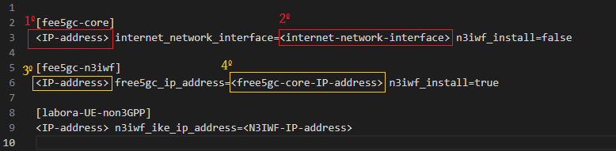

## Configuração de Ambiente para coleta de dados de QoS (5QI) em redes 5G

O tutorial foi baseado no ambiente divulgado pelo Ciro Macedo no vídeo disponível em: https://www.youtube.com/watch?v=UswQTnTZGt4

# Environment
Ambiente necessita de 4 máquinas para funcionar. O ambiente foi desenvolvido na AWS. Ao acessar deve-se criar 4 máquinas com os seguintes nomes e requisitos abaixo:
    - Máquina 1: free5GC
    - Máquina 2: N3IWF
    - Máquina 3: UE
    - Máquina 4: Máquina do Operador (openinstallcc)

SO: Ubuntu 20.04 (LTS) x64
Uname -r: 5.4.0-122-generic
Memory: 4 GB
Disk: 80 GB

Utilizado gerenciador de acesso remoto do VS Code para acessar as máquinas

# permitir acesso a pasta AWS
Para liberar acesso ao gerenciamento de pastas caso utilizar um gerenciador de ssh deve permitir acesso ao usuário atual para editar as pastas, neste caso o usuário é ubuntu
```
sudo chown -R ubuntu /home/ubuntu/

```

# instalar bibliotecas necessárias
```
sudo apt update && apt -y install python && sudo apt -y install git && sudo apt -y install ansible && sudo apt -y install net-tools

```

# Clone do projeto na máquina do operador (neste projeto openinstallcc)
```
apt update && git clone https://github.com/LABORA-INF-UFG/UE-non3GPP.git 

```

# Editar IP das máquinas no arquivo de conexão de hosts
Editar o arquivo em UE-non3GPP/dev/free5gc-v3.1.1/hosts e editar os IP's das máquinas de acesso e a interface de rede da máquina com o core através do comando abaixo no terminal linux e verificar qual nome da interface que faz conexão com a internet
 
```
ifconfig

```

<p float="left">
    
</p>